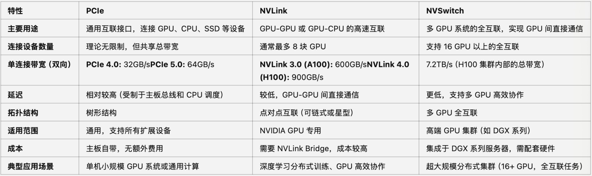
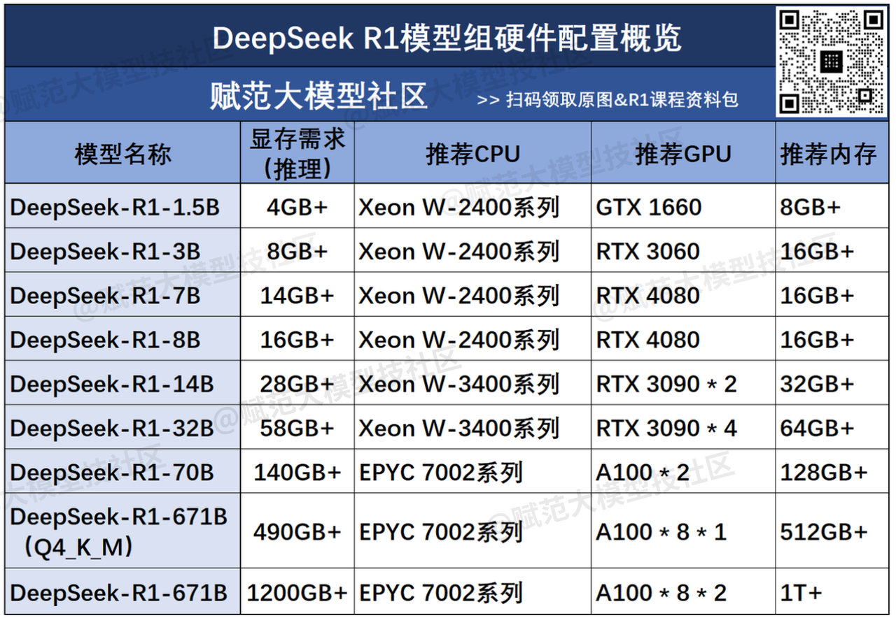
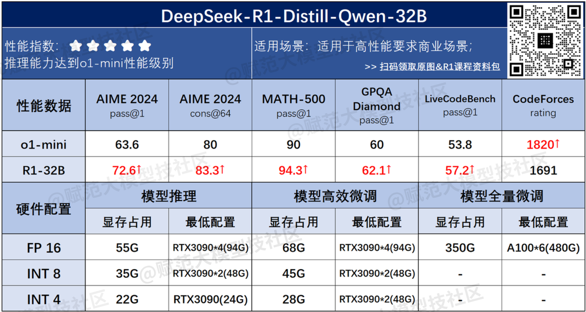
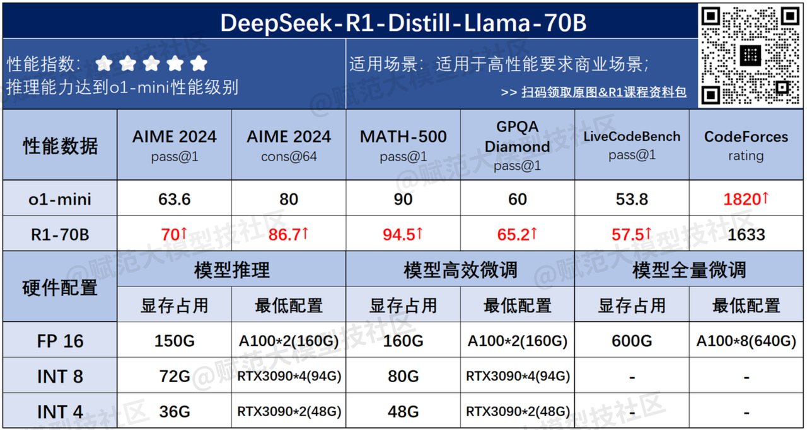
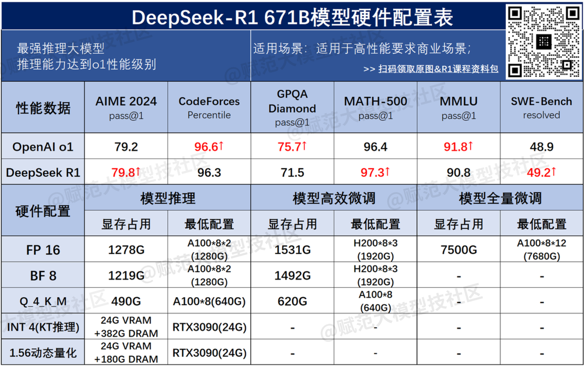

# 环境部署及本地调用


## 环境准备


### 硬件基础

* CUDA Cores：CUDA核心，是NVIDIAGPU的基础计算单元，负责执行并行计算任务。
* Tensor Cores：张量计算核心，是专⻔设计用于矩阵运算的硬件单元，核心任务是加速矩阵乘法，特别是用于深度学习的张量运算，其中20系显卡开始加入张量核心。
* GPU Memory：显存，决定了可以加载的模型大小、数据批量（BatchSize）以及中间激活值存储，显存不足会限制任务规模，甚至导致程序崩溃。
* FLOPS：每秒浮点计算次数，是衡量GPU浮点运算性能的单位，代表GPU的理论性能。
* NVLink&NVSwitch：显卡桥接技术，替代方案是PCIE。


PCIe、NVLink与NVSwitch对比




### DeepSeek配置一览表










### 在线GPU算力

可白嫖的资源有Colab、vast.ai、国内的阿里云、腾讯云等。但限制比较多。


PAI平台选交互式建模PAI-DSW。


### Ubuntu系统安装

1. 下载Ubuntu系统（桌面版），https://ubuntu.com
2. 下载启动盘制作工具Rufus，http://rufus.ie/zh
3.  制作系统启动盘（至少8G），分区类型：MBR，目标系统：BIOS或UEFI，文件系统：FAT32，其实默认即可。
4. 查看系统BIOS是否是UEFI模式，通过运行中键入msinfo32，如果不是，需要重装。
5. 磁盘分区。双系统时，需要预先指定Ubuntu的空间，以确保独立性。右键此电脑，管理，选择磁盘管理，通过压缩卷分出大约200~300G。双硬盘时，需要在C盘先分出200M来存储Ubuntu的启动项。
6. 关闭Windows快速启动。控制面板中选择电源选项，找到选择电源按钮的功能，更改当前不可用的设置，在关机设置中取消启用快速启动。
7. 安装Ubuntu
   1. 开机时按Del、F2或F11，进入BIOS
   2. 需要关闭安全中的Secure Boot，保险起见也关闭启动中的快速启动，禁用MSI快速开机以及快速开机。
   3. 调整启动项顺序，将USB放到第一个。
   4. 重启后选择Try or Install Ubuntu。初始语言推荐选择英文，美式布局。
   5. 选择标准安装即可。
   6. 双系统选择Install Ubuntu alongside。这个选项会自动缩小现有操作系统分区，设置双系统引导。Something else是一个高级选项，用户可以手动分配磁盘空间和创建分区。这里选择后者。
   7. EFI系统分区：
      1. 单硬盘：选中free space，点击加号。设置2048M，逻辑分区，空间起始位置，用于EFI。
      2. 双硬盘：先找到事前准备的空闲分区，大小全占用，其他设置一致。
   8. swap分区：一种物理内存补充机制，称为交换空间，一般大小为物理内存2倍，这里设置为8192M，逻辑分区，空间起始位置，用于swap。
   9. 主分区：相当于C盘，102400M，主分区，空间起始位置，用于ext4日志文件系统，挂载点为/，主分区空间可以大一些。
   10. home：其它空间统一为home，主分区，空间起始位置，用于ext4日志文件系统，挂载点为/home。
8. 选择安装启动项的位置，通过编号指定到前面创建的EFI系统分区。
9. 设置用户名和密码。
10. 安转完成后，拔出U盘，重新启动，通常会看到系统启动选择，如果没有，要重新进入BIOS，找到UEFI硬盘BBS优先权，将Ubuntu的引导项提到首位。


### Ubuntu系统初始化配置

1. 更换国内源，进入/etc /apt路径，找到源配置文件sources.list，将其备份。

```terminal
cd /ect/apt
sudo cp sources.list sources.list.backup
```

2. 安装vim编辑器，然后修改配置文件，i是插入，然后按ESC，:wq!是保存退出。

```terminal
sudo apt install vim
sudo vim sources.list
```


3. 终端更新软件包列表

```terminal
sudo apt update
sudo apt upgrade
```

4. 设置英文目录路径，如果安装时选择的是英文，这里可以跳过。

```terminal
# echo 'en_US' > ~/.config/user-dirs.locale
export LANG=en_US
xdg-user-dirs-gtk-update
```

5. 安装谷歌浏览器，后缀为deb。Ubuntu使用DPKG包管理系统来安装、删除和管理.deb包。进入下载目录后

```terminal
sudo dpkg -i google-chrome-stable_current_amd64.deb
```

6. 配置VPN，课程使用了pigcha加速器，https://www.pigcha.com.hk


